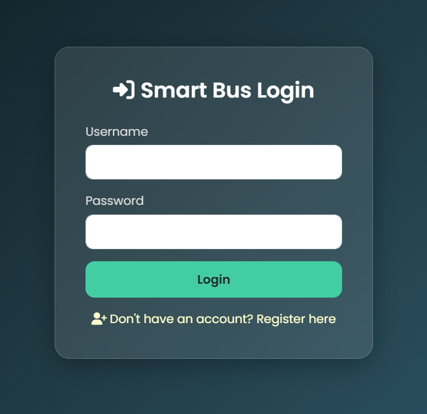

# 🚍 Smart Bus Tracking Web App

A web-based Smart Bus Tracking System that helps **students**, **drivers**, and **administrators** track and manage buses in real time. This project aims to increase safety, convenience, and operational efficiency in educational or private transportation systems.

---

## ✨ Key Highlights

- 🔒 Role-based login for Admin, Student, and Driver
- 🚌 Add/edit buses, drivers, and routes
- 📍 Track bus status and route
- 👨‍🏫 Admin dashboard to monitor everything
- 📦 CI/CD pipeline with Jenkins & Docker
- 🌐 Fully deployable using Apache Tomcat


---

## 🔧 Tech Stack

| Layer        | Technologies                                |
|--------------|---------------------------------------------|
| Frontend     | HTML, CSS, JSP, JavaScript                  |
| Backend      | Java (Servlets & JSP), JDBC, MySQL          |
| Server       | Apache Tomcat 9                             |
| DevOps       | Jenkins, Docker, Git, GitHub                |
| Build Tool   | Maven                                       |

---

## 🧩 Modules & Features

### 🔐 Authentication
- ✅ Login and Registration for **Student**, **Driver**, and **Admin**
- ✅ Password validation and session handling
- ✅ Role-based redirects


### 👨‍🏫 Admin Panel
- 🚌 Add, update, delete buses
- 👨‍✈️ Manage drivers and assign buses
- 🗺️ Create and assign routes (source, stops, destination)
- 🧾 View all users, buses, drivers, and routes
- 📊 Generate reports of daily usage

### 🎓 Student Panel
- 👁️ View assigned bus and its current location
- 🗺️ See route map (static or simulated)
- 🔁 Update profile and contact info

### 👨‍✈️ Driver Panel
- 🚌 View assigned bus and route details
- ✅ Mark trip as "Started" or "Completed"
- 🧭 Option to update simulated location/status (for now)

---

## 🗄️ Database Schema (MySQL)

### `users`
| Field     | Type     | Description                      |
|-----------|----------|----------------------------------|
| id        | INT      | Primary Key                      |
| name      | VARCHAR  | Full name                        |
| email     | VARCHAR  | Unique email address             |
| password  | VARCHAR  | Encrypted password               |
| role      | ENUM     | 'admin', 'student', 'driver'     |
| address   | TEXT     | Address (optional)               |

### `buses`
| Field       | Type     | Description                   |
|-------------|----------|-------------------------------|
| id          | INT      | Primary Key                   |
| bus_number  | VARCHAR  | Unique Bus Number             |
| driver_id   | INT      | Linked to `users.id`          |
| route_id    | INT      | Linked to `routes.id`         |

### `routes`
| Field       | Type     | Description                   |
|-------------|----------|-------------------------------|
| id          | INT      | Primary Key                   |
| source      | VARCHAR  | Starting point                |
| destination | VARCHAR  | Endpoint                      |
| stops       | TEXT     | Intermediate stop points      |

---

## 📂 Project Structure

```plaintext
SmartBusTracker/
├── src/
│   └── main/
│       ├── java/
│       │   └── servlets/         # Login, Register, Dashboard, Controllers
│       └── webapp/
│           ├── WEB-INF/
│           │   └── web.xml       # Servlet mapping
│           ├── jsp/
│           │   ├── login.jsp
│           │   ├── register.jsp
│           │   ├── admin-dashboard.jsp
│           │   ├── student-dashboard.jsp
│           │   └── driver-dashboard.jsp
│           └── assets/           # CSS, JS, images
├── pom.xml
├── Dockerfile
├── Jenkinsfile
└── README.md
